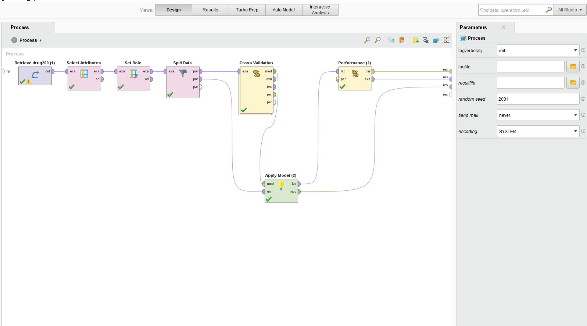
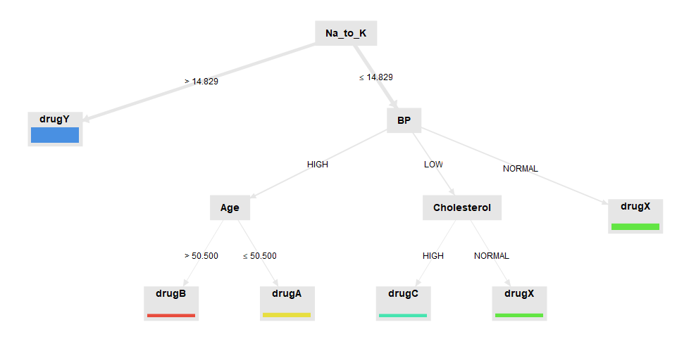
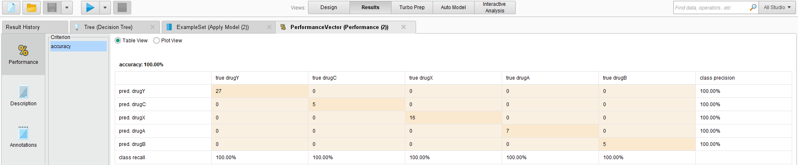

# Decision Tree - Drug Classification (RapidMiner)
##  🎯 Objective 
Train a Decision Tree to classify drug category based on patient attributes.
##  🗂 Data
- Source: `data/drug200 (1).csv` → The dataset used for this analysis.
- Target: `drug` (categorical)
## 🔄 Process (RapidMiner)
1. **Read Data** → set correct file path  
2. **Preprocessing**: handle missing values / encode categoricals (Nominal to Numerical if needed)  
3. **Split Data**: Train/Test (e.g., 70/30, fixed random seed)  
4. **Modeling**: `Decision Tree` operator (criterion: gain_ratio / information_gain)  
5. **Evaluation**: `Apply Model` → `Performance (Classification)`

## 📊 Results
- **Accuracy:** 100% 
- **Precision / Recall / F1:** 100%/100%/100%
## 🖼 Screenshots
### Process

### Tree

### Performance

## ▶️ How to Run
1. Open **RapidMiner Studio**  
2. `File → Open Process…` → `drugs_decision_tree.rmp`  
3. Update dataset path in the `Read CSV/Excel` operator if required  
4. Run the process and compare metrics with this README

