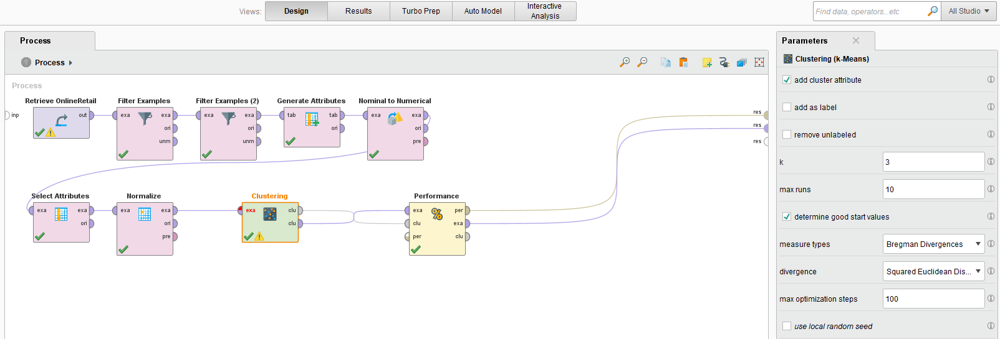
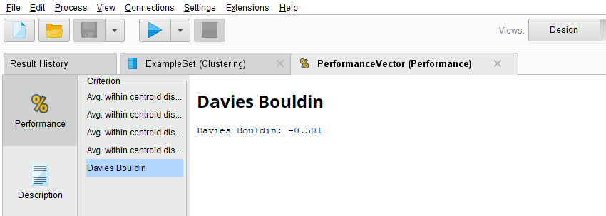

# K-Means – Online Retail Customer Segmentation (RapidMiner)

## 🎯 Objective
Cluster customers into segments using **K-Means** and interpret segment profiles.

## 🗂 Data
- Source: `data/OnlineRetail.csv`

## 🔄 Process
- Preprocessing (filtering, encoding attributes )
- Standardization
- **Operator:** K-Means (k = 3, selection via Elbow/Silhouette)
- Cluster profiling

## 📊 Results
- Chosen k: 3  
- Davies-Bouldin: -0.501

## 🖼 Screenshots
### Process

### Results

## ▶️ How to Run
1. Open **RapidMiner Studio**  
2. `File → Open Process…` → `online_retail_k_means.rmp`  
3. Update dataset path in the `Read CSV/Excel` operator if required  
4. Run the process and compare metrics with this README
