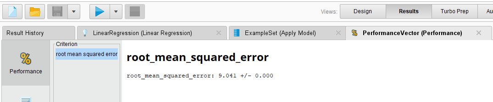

# Linear Regression – Retail Pricing/Profits (RapidMiner)

## 🎯 Objective
Model the relationship between features and price/profit.

## 🗂 Data
- Source: `data/OnlineRetail.csv`
- Target: `profit` (numeric)

## 🔄 Process
- Preprocessing (filtering, encoding attributes)
- Train/test split
- **Operators:** Linear Regression (+ optional feature selection)
- Evaluation: RMSE

## 📊 Results
- RMSE: 9.041 +/- 0.000

## 🖼 Screenshots
### Process

### Results

## ▶️ How to Run
1. Open **RapidMiner Studio**  
2. `File → Open Process…` → `online_retail_linear_regr.rmp`  
3. Update dataset path in the `Read CSV/Excel` operator if required  
4. Run the process and compare metrics with this README
